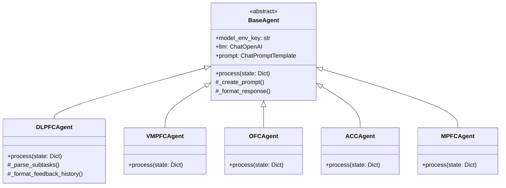
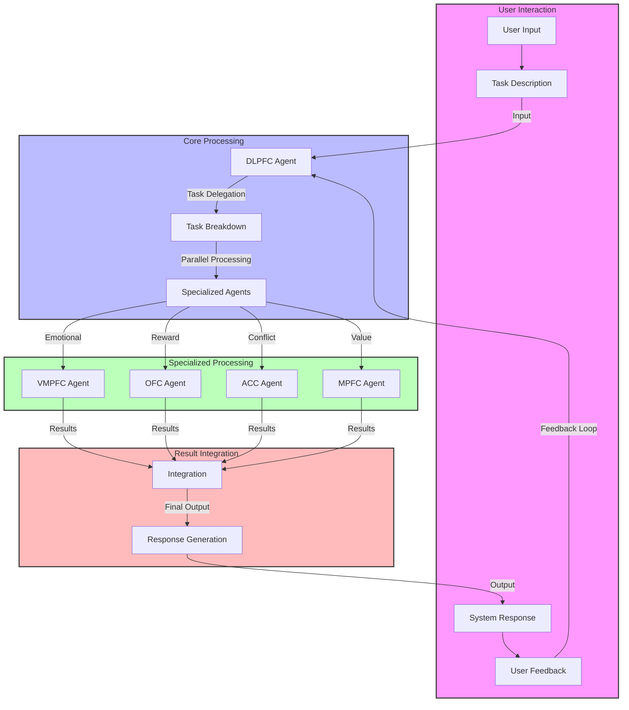

# SCANUE-V: Specialized Cognitive Agent Neural Network Unified Environment

A brain-inspired multi-agent decision-making framework that mimics cognitive processes using specialized neural agents.

## Overview

SCANUE-V implements a cognitive architecture inspired by brain regions, where specialized agents work together to process and make decisions. Each agent represents a specific brain region and handles different aspects of cognitive processing.

## Features

- **Brain-Inspired Architecture**: Models different brain regions as specialized agents
- **Multi-Agent Processing**: Coordinated decision-making through multiple cognitive stages
- **Human-in-the-Loop Feedback**: Continuous learning from user feedback
- **Robust Error Handling**: Comprehensive error management across all processing stages
- **Asynchronous Processing**: Efficient parallel processing of cognitive tasks

## Cognitive Agents

- **DLPFC Agent**: Task delegation and executive control
- **VMPFC Agent**: Emotional regulation and risk assessment
- **OFC Agent**: Reward processing and outcome evaluation
- **ACC Agent**: Conflict detection and error monitoring
- **MPFC Agent**: Value-based decision making

## Technical Requirements

- Python 3.8+
- OpenAI API Key
- Required Environment Variables:
  ```
  OPENAI_API_KEY=<your-api-key>
  DLPFC_MODEL=ft:gpt-4o-mini-2024-07-18:personal:dlpfcv2:A4gAvc9k
  ACC_MODEL=ft:gpt-4o-mini-2024-07-18:personal:accv4:A5hb0Wp0
  OFC_MODEL=ft:gpt-4o-mini-2024-07-18:personal:ofcv3datasetnew09092924:A5h8dT2o
  VMPFC_MODEL=ft:gpt-4o-mini-2024-07-18:personal:vmpfcv2:A523M03L
  MPFC_MODEL=ft:gpt-4o-mini-2024-07-18:personal:mpfcv2:A8xFTDjF
  ```

## Installation

1. Clone the repository
2. Install dependencies:
   ```bash
   pip install -r requirements.txt
   ```
3. Set up environment variables in `.env` file
4. Run the application:
   ```bash
   python main.py
   ```

## Workflow

1. User inputs a task or problem
2. DLPFC Agent breaks down the task and delegates subtasks
3. Specialized agents process their aspects:
   - VMPFC: Emotional regulation
   - OFC: Reward processing
   - ACC: Conflict detection
   - MPFC: Value assessment
4. Results are integrated and presented to the user
5. User provides feedback for continuous improvement

## Testing

Run the test suite:
```bash
pytest tests/
```

## Architecture Diagrams

### Class Diagram


### Data Flow Diagram


## License

MIT License

## Contributing

Contributions are welcome! Please feel free to submit a Pull Request.
