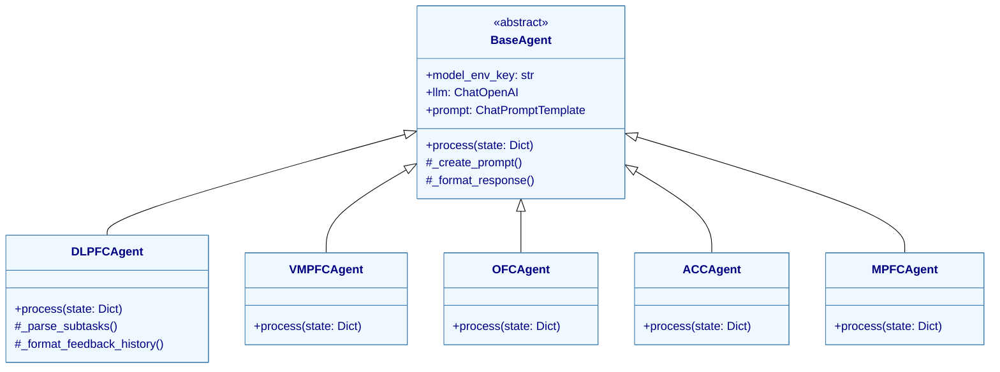
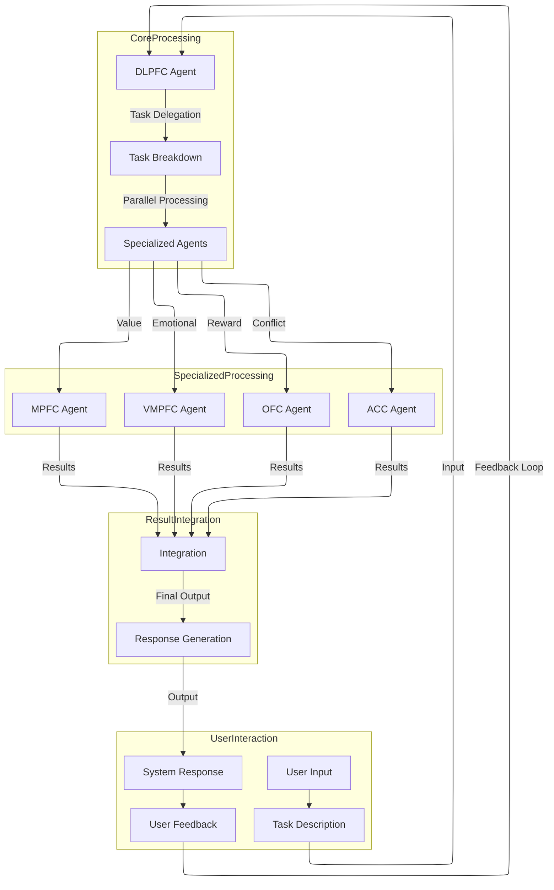
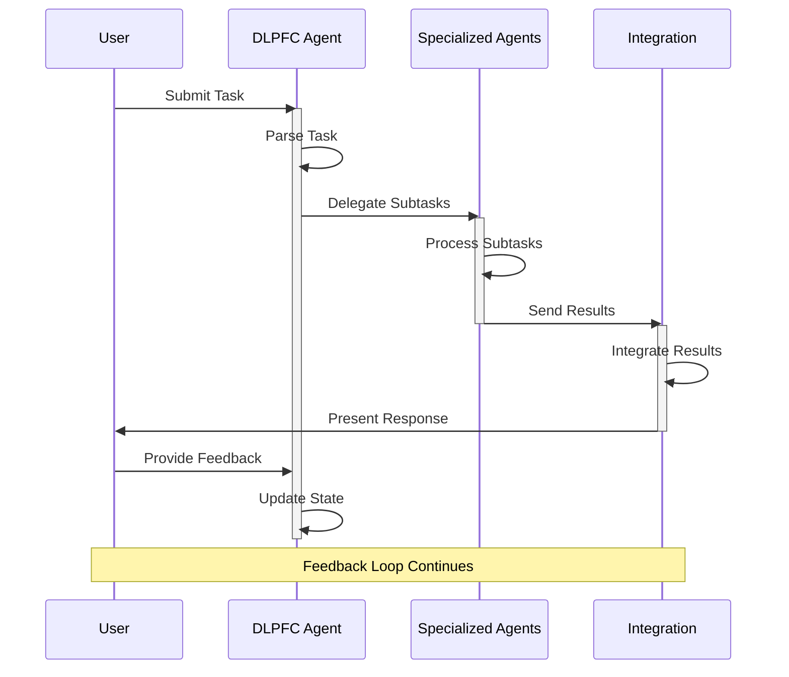

# **SCANUE-V22**

[](https://doi.org/10.5281/zenodo.14510406)

## **Cognitive Agents**
- **DLPFC Agent:** Task delegation and executive control.
- **VMPFC Agent:** Emotional regulation and risk assessment.
- **OFC Agent:** Reward processing and outcome evaluation.
- **ACC Agent:** Conflict detection and error monitoring.
- **MPFC Agent:** Value-based decision-making.

---

## **Technical Requirements**
- **Python:** 3.8+
- **OpenAI API Key**
- **Required Environment Variables:**
  ```plaintext
  OPENAI_API_KEY=YOUR_OPENAI_API_KEY_HERE
  DLPFC_MODEL=DLPFC_MODEL_ID_HERE
  ACC_MODEL=ACC_MODEL_ID_HERE
  OFC_MODEL=OFC_MODEL_ID_HERE
  VMPFC_MODEL=VMPFC_MODEL_ID_HERE
  MPFC_MODEL=MPFC_MODEL_ID_HERE
  ```

---

## **Installation**

1. **Clone the repository:**
   ```bash
   git clone https://github.com/your-repo/SCANUE-V22.git
   cd SCANUE-V22
   ```

2. **Install dependencies:**
   ```bash
   pip install -r requirements.txt
   ```

3. **Set up environment variables** in `.env` file.

4. **Run the application:**
   ```bash
   python main.py
   ```

---

## **Workflow**
1. User inputs a task or problem.
2. **DLPFC Agent:** Breaks down the task and delegates subtasks.
3. Specialized agents process their aspects:
   - **VMPFC:** Emotional regulation.
   - **OFC:** Reward processing.
   - **ACC:** Conflict detection.
   - **MPFC:** Value assessment.
4. Results are integrated and presented to the user.
5. User provides feedback for continuous improvement.

---

## **Testing**
Run the test suite:

```bash
pytest tests/
```

---

## **Architecture Diagrams**

### **Class Diagram**



---

### **Data Flow Diagram**



---

### **User Interaction Flow**



---

## **License**
MIT License

---

## **Contributing**
Contributions are welcome! Please feel free to submit a Pull Request.

--- 
